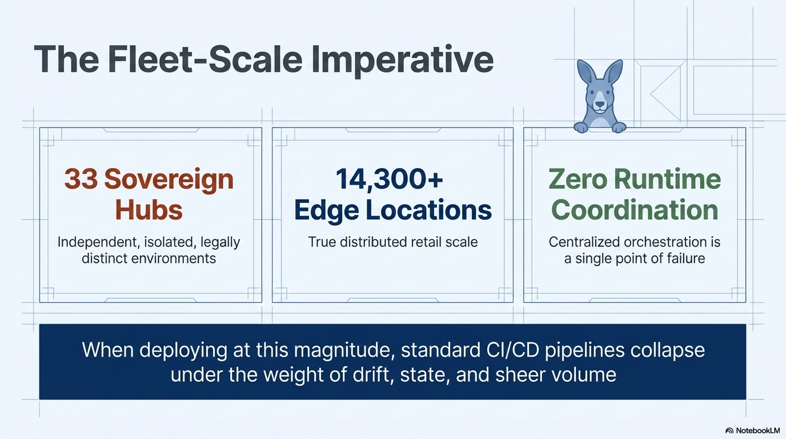
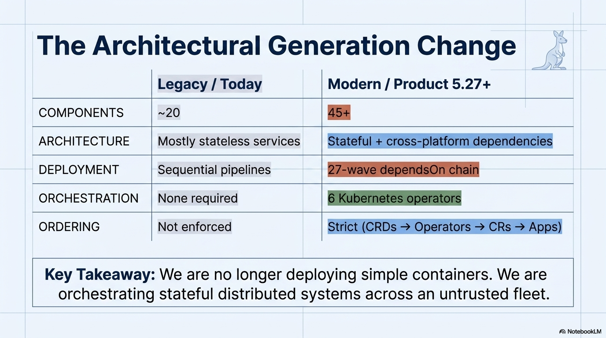
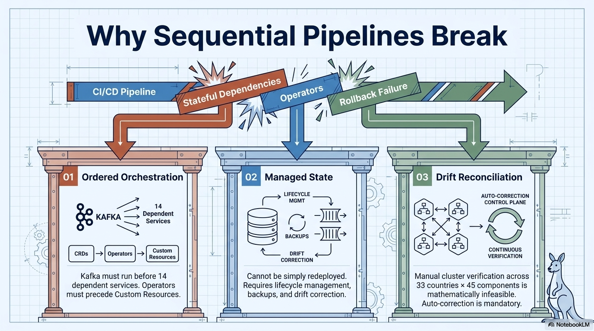
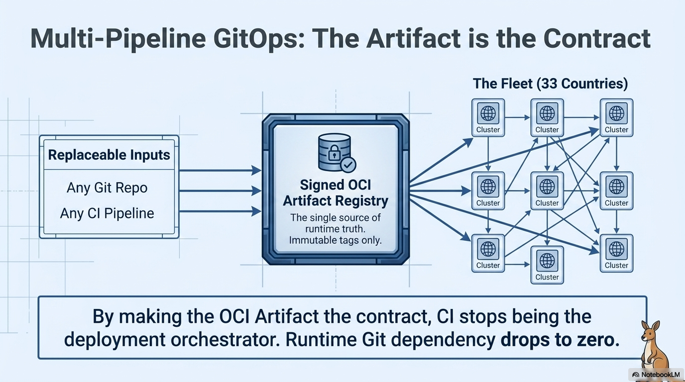
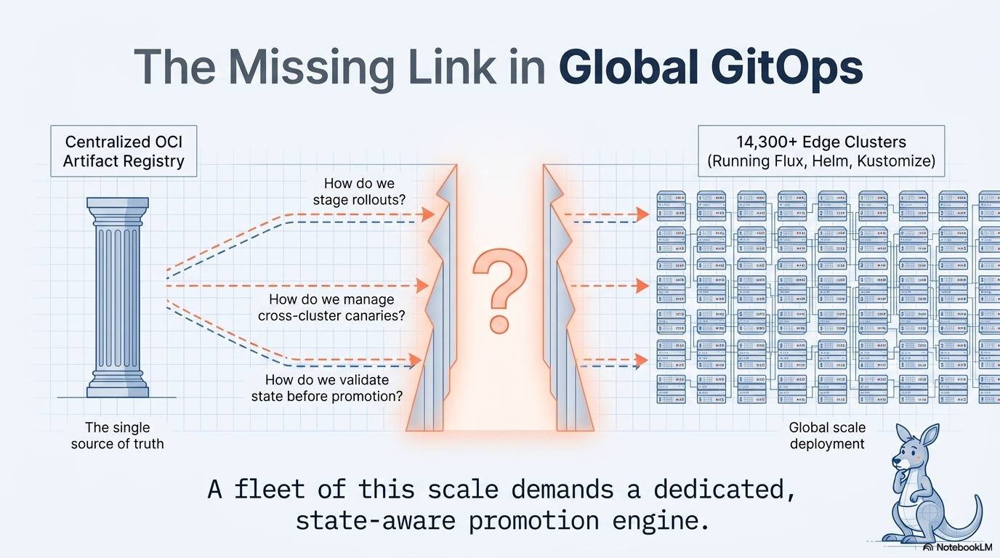
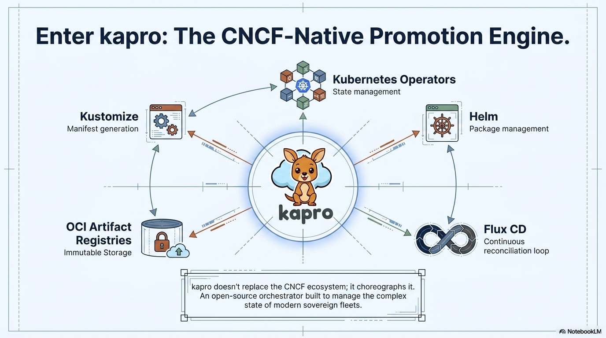
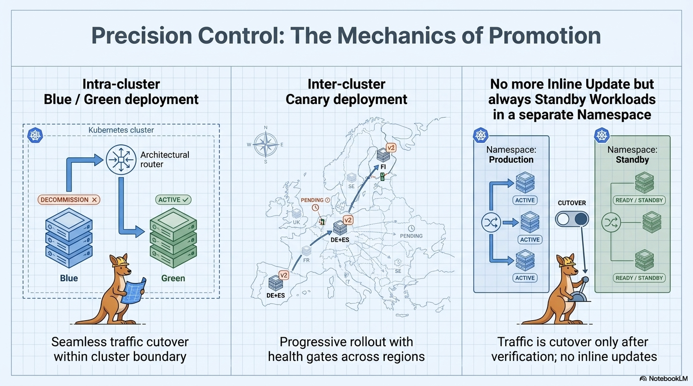
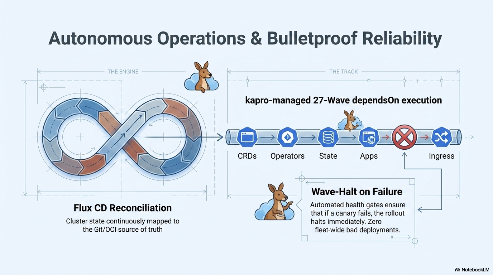
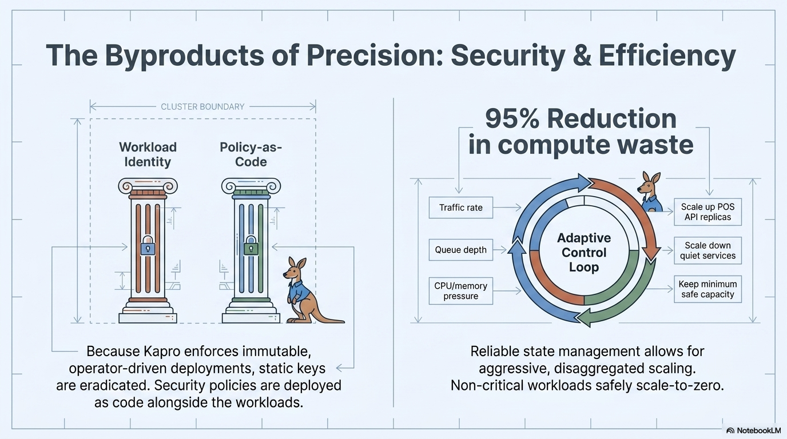
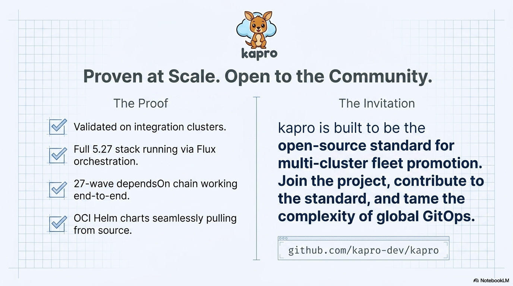

<p align="center">
  
</p>

<h1 align="center">Kapro</h1>

<p align="center"><strong>The canonical promotion layer for Kubernetes.</strong><br>
Purpose-built for sovereign fleet GitOps at global scale.</p>

<p align="center">
  <a href="LICENSE"></a>
  <a href="https://goreportcard.com/report/kapro.io/kapro"></a>
  <a href="api/v1alpha1"></a>
</p>

---

## The Fleet-Scale Imperative

When you're deploying across sovereign hubs, thousands of edge locations, and zero tolerance for centralized runtime coordination — standard CI/CD pipelines collapse under the weight of drift, state, and sheer volume.

<p align="center">
  
</p>

## The Generation Change

We are no longer deploying simple containers. Modern platforms orchestrate stateful distributed systems — with cross-platform dependencies, ordered deployment waves, and strict reconciliation loops — across an untrusted fleet.

<p align="center">
  
</p>

## Why Sequential Pipelines Break

Traditional CI/CD assumes a linear world: build, test, deploy. But when Kafka must run before 14 dependent services, databases need managed state, and clusters must self-correct drift — sequential pipelines simply cannot express this.

<p align="center">
  
</p>

## The Artifact is the Contract

Kapro decouples CI from deployment. The OCI artifact becomes the single source of truth — immutable, signed, and version-locked. Any git repo, any CI pipeline can produce it. Runtime git dependency drops to zero.

<p align="center">
  
</p>

## The Missing Link in Global GitOps

You have a centralized artifact registry. You have thousands of edge clusters running Flux, Helm, and Kustomize. But how do you stage rollouts? Manage cross-cluster canaries? Validate state before promotion?

A fleet of this scale demands a dedicated, state-aware promotion engine.

<p align="center">
  
</p>

## Enter Kapro

Kapro doesn't replace the CNCF ecosystem. It choreographs it. An open-source orchestrator built to manage the complex state of modern sovereign fleets.

<p align="center">
  
</p>

## Precision Control: The Mechanics of Promotion

<p align="center">
  
</p>

- **Intra-cluster blue/green** — seamless traffic cutover within cluster boundary
- **Inter-cluster canary** — progressive rollout with health gates across regions
- **No inline updates** — traffic is cutover only after verification, standby workloads always in a separate namespace

## Autonomous Operations and Bulletproof Reliability

Kapro manages 27-wave dependsOn execution across CRDs, operators, state, apps, and ingress. Automated health gates ensure that if a canary fails, the rollout halts immediately. Zero fleet-wide bad deployments.

<p align="center">
  
</p>

## The Byproducts: Security and Efficiency

Because Kapro enforces immutable, operator-driven deployments, static keys are eradicated. Security policies are deployed as code alongside the workloads. Reliable state management enables aggressive disaggregated scaling — non-critical workloads safely scale to zero.

<p align="center">
  
</p>

## Getting Started

```bash
# Bootstrap a hub cluster
kapro hub init --project my-project --cluster my-hub

# Add spoke clusters to the fleet
kapro spoke add de-prod --provider gcp-fleet --labels tier=canary
kapro spoke add fi-prod --provider gcp-fleet --labels tier=prod

# Define your app and delivery pipeline
kubectl apply -f kaproapp.yaml
kubectl apply -f kapro.yaml

# Push a version from CI
kapro bundle generate --app my-app --version 1.0.0 --push

# Create a release — Kapro handles the rest
kubectl apply -f release.yaml
```

## Documentation

- [Architecture Spec](docs/SPEC.md)
- [Roadmap](docs/ROADMAP.md)

## Proven at Scale. Open to the Community.

<p align="center">
  
</p>

Kapro is built to be the open-source standard for multi-cluster fleet promotion. Join the project, contribute to the standard, and tame the complexity of global GitOps.

## License

Apache 2.0 — see [LICENSE](LICENSE).
