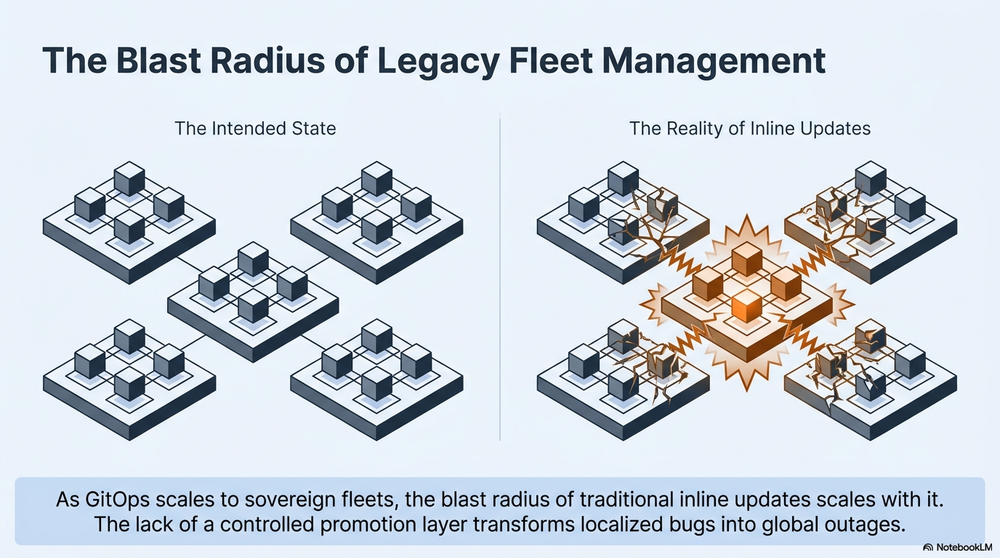
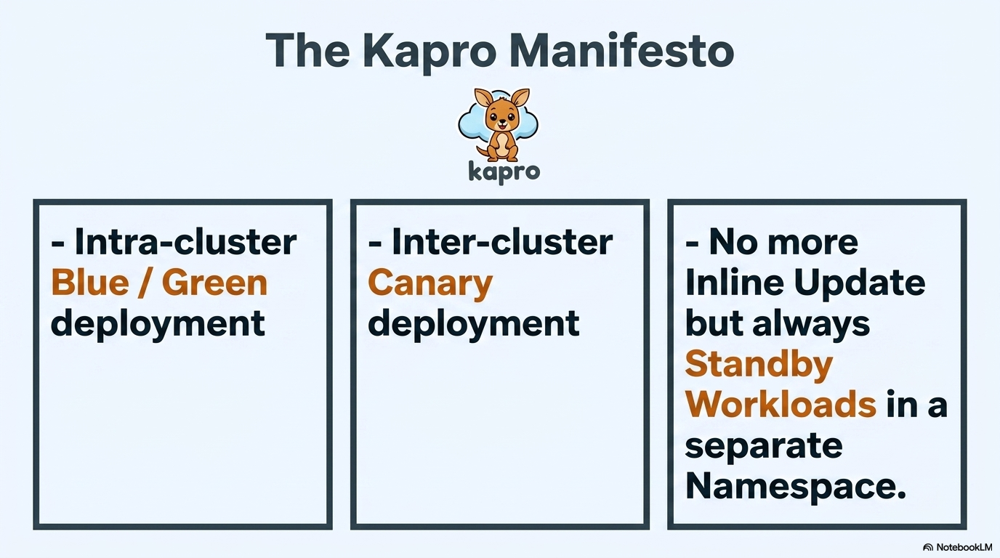
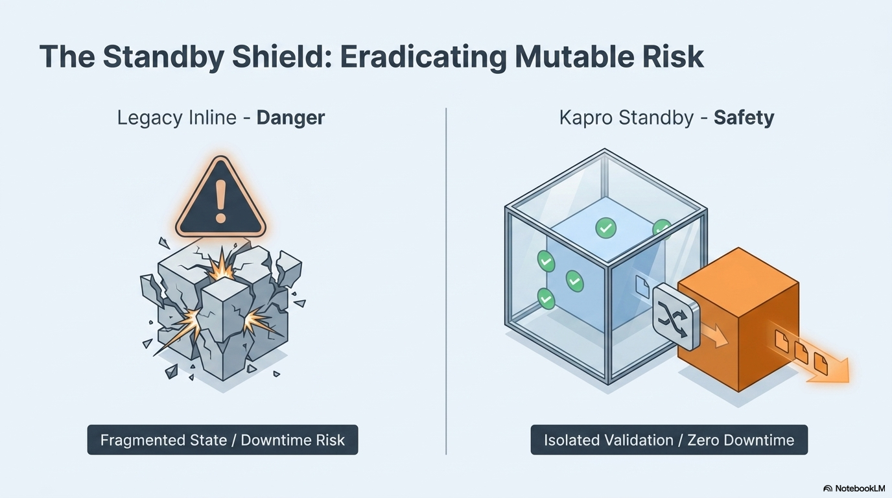
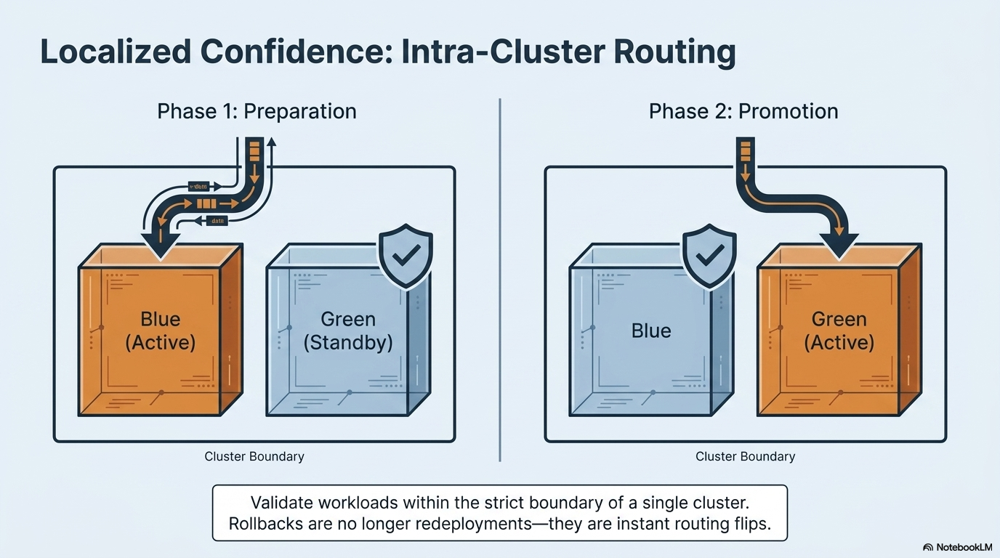
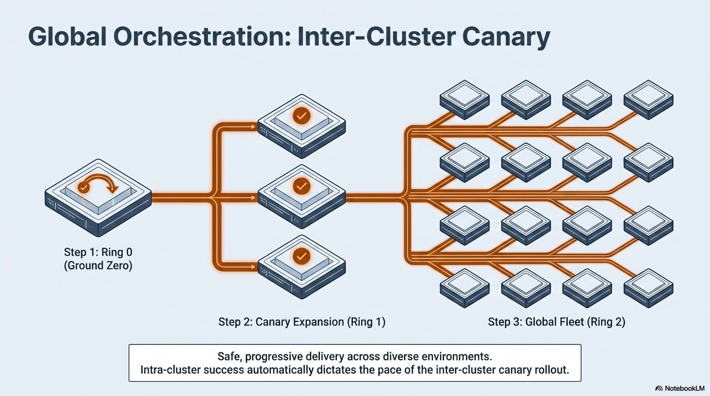
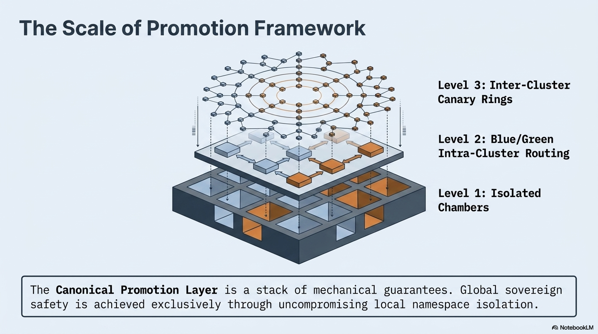
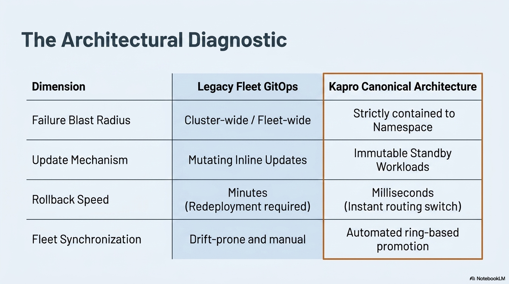
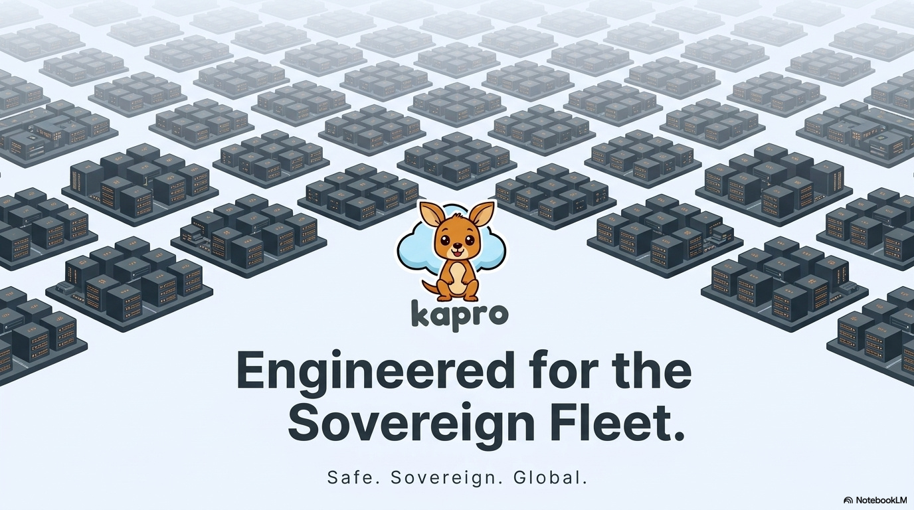

<p align="center">
  
</p>

<h1 align="center">Kapro</h1>

<p align="center"><strong>Progressive delivery and promotion engine for multi-cluster Kubernetes fleets.</strong></p>

<p align="center">
  <a href="LICENSE"></a>
  <a href="https://goreportcard.com/report/kapro.io/kapro"></a>
  <a href="api/v1alpha1"></a>
</p>

---

## The Problem

As GitOps scales to sovereign fleets, the blast radius of traditional inline updates scales with it. The lack of a controlled promotion layer transforms localized bugs into global outages.

<p align="center">
  
</p>

## The Kapro Approach

Kapro is a **canonical promotion layer** that sits between your CI pipeline and your fleet. It controls **when**, **where**, and **how safely** new versions reach each cluster.

<p align="center">
  
</p>

- **Intra-cluster blue/green deployment** — new versions deploy into a standby namespace, fully isolated from live traffic
- **Inter-cluster canary rings** — promote across clusters in ordered waves, from a single canary to global fleet
- **No more inline updates** — standby workloads are validated before they ever serve a single request

## Safe by Design

Legacy GitOps mutates live workloads in-place. One bad image tag and your checkout system is down. Kapro eliminates this by deploying into isolated standby namespaces first.

<p align="center">
  
</p>

## How Promotion Works

### Level 1: Blue/Green Within a Cluster

Workloads are validated inside a standby namespace. The switch to live is an instant routing flip — not a redeployment. Rollbacks take milliseconds.

<p align="center">
  
</p>

### Level 2: Canary Rings Across the Fleet

Start with a single cluster (Ring 0). If it's healthy, expand to a canary group (Ring 1). Only after automated gates pass does the version reach the global fleet (Ring 2).

<p align="center">
  
</p>

### The Full Stack

The promotion framework is a stack of mechanical guarantees. Global sovereign safety is achieved exclusively through uncompromising local namespace isolation.

<p align="center">
  
</p>

## Why Not Just GitOps?

Kapro doesn't replace Flux or ArgoCD — it orchestrates them.

<p align="center">
  
</p>

| | Legacy Fleet GitOps | Kapro |
|---|---|---|
| **Blast radius** | Cluster-wide / fleet-wide | Contained to a namespace |
| **Updates** | Mutating inline updates | Immutable standby workloads |
| **Rollback** | Minutes (redeployment) | Milliseconds (routing switch) |
| **Fleet sync** | Drift-prone and manual | Automated ring-based promotion |

## Built For

- **Retail / POS systems** where checkout downtime costs real revenue
- **Sovereign fleets** across countries with different compliance requirements
- **Air-gapped clusters** behind NAT and firewalls with no inbound connectivity
- **Regulated industries** that need human approval gates and full audit trails
- **Multi-cloud fleets** spanning GCP, AWS, Azure, StackIT, or on-prem

## Gates and Safety

Every promotion step can be guarded by composable gates:

- **Soak time** — wait for a minimum healthy period before advancing
- **Metrics** — evaluate PromQL queries against live cluster data
- **Human approval** — block until an authorized person approves
- **Verification** — cosign artifact signature checks
- **Webhooks** — call external systems for custom validation
- **Health checks** — active endpoint polling

Gates are stackable. A single stage can require signature verification, a 30-minute soak, passing error rate metrics, and human sign-off — all before the next ring begins.

## Getting Started

```bash
# Bootstrap a hub cluster
kapro hub init --project my-project --cluster my-hub

# Add spoke clusters to the fleet
kapro spoke add de-prod --provider gcp-fleet --labels tier=canary
kapro spoke add fi-prod --provider gcp-fleet --labels tier=prod

# Define your app and delivery pipeline
kubectl apply -f kaproapp.yaml
kubectl apply -f kapro.yaml

# Push a version (from CI)
kapro bundle generate --app my-app --version 1.0.0 --push

# Create a release — Kapro handles the rest
kubectl apply -f release.yaml

# Watch it roll out
kapro status
```

## Documentation

- [Architecture Spec](docs/SPEC.md)
- [Roadmap](docs/ROADMAP.md)

<p align="center">
  
</p>

<p align="center"><em>Safe. Sovereign. Global.</em></p>

## License

Apache 2.0 — see [LICENSE](LICENSE).
