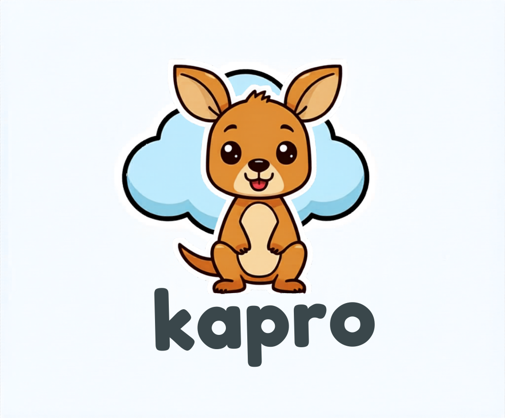

<p align="center">
  
</p>

<h1 align="center">Kapro</h1>

<p align="center"><strong>A promotion control plane for Kubernetes fleets.</strong><br>
Kapro coordinates when an artifact version should move across clusters while
Flux, Argo CD, OCI pull agents, and other delivery systems keep owning the local rollout.</p>

<p align="center">
  <a href="LICENSE"></a>
  <a href="https://github.com/Kapro-dev/kapro/releases/latest"></a>
  <a href="https://github.com/Kapro-dev/kapro/actions/workflows/ci.yml"></a>
  <a href="https://goreportcard.com/report/kapro.io/kapro"></a>
  <a href="api/kapro/v1alpha1"></a>
  <a href="https://kapro.dev"></a>
</p>

---

Kapro is **pre-stable public release software**, not GA. The current public
preview line is `v0.6.x`; user-authored APIs live in `kapro.io/v1alpha1` and
controller-owned runtime records live in `runtime.kapro.io/v1alpha1`. This is a
clean pre-stable break; there is no automatic conversion for older alpha
manifests.

## Why Kapro

Kapro answers one operational question:

```text
Which clusters are allowed to receive this artifact version now, and why?
```

It is useful when one application version must move through many clusters,
regions, environments, or connectivity models without burying promotion state in
CI scripts.

- **Fleet-wide promotion intent:** model waves, gates, approvals, and target
  selection as Kubernetes API state.
- **Substrate-neutral delivery:** keep Flux, Argo CD, OCI pull agents, and custom
  plugins in charge of local rollout mechanics.
- **Auditable attempts:** inspect durable `Promotion` intent, immutable
  `PromotionRun` attempts, and per-target runtime records after CI has exited.

## Boundaries

Kapro owns:

- cross-cluster promotion intent;
- stage and wave ordering;
- target selection;
- gate and approval state;
- per-target execution records;
- substrate convergence evidence.

Kapro does not build artifacts, render manifests, replace GitOps controllers,
or implement in-cluster traffic shifting. Those jobs stay with CI, Helm,
Kustomize, Flux, Argo CD, Argo Rollouts, service mesh controllers, or custom
platform tooling.

Permanent non-goals: Kapro is not a Helm registry, CI runner, manifest store,
cluster provisioner, or secret store.

Public preview product boundaries:

- Kapro does not build artifacts or run CI.
- Kapro does not provision clusters.
- Kapro does not store secrets.
- Kapro does not act as a Helm registry or manifest store.
- Kapro does not replace Flux, Argo CD, OCI agents, Argo Rollouts, Flagger,
  Sveltos, Terraform, Cluster API, or secret managers.

## Core Concepts

| Kind | Role |
|---|---|
| `DeliveryUnit` | App/workload source mappings, trigger intent, and default fleet/plan. |
| `Fleet` | Target set: clusters and delivery defaults. |
| `Source` | Controller-derived source mapping object from a DeliveryUnit. |
| `Substrate` | Delivery driver configuration for Flux, Argo CD, OCI, direct apply, or plugin-backed execution. |
| `Plan` | Stage order, target selection, and gates. |
| `Promotion` | Explicit rollout action: "promote this DeliveryUnit version through this Fleet." |
| `PromotionRun` | Controller-authored execution attempt and audit record. |
| `Target` | Per-cluster, per-stage runtime state. |
| `Cluster` | A workload cluster known to the hub. |
| `Approval` | Human approval or rejection for a gated target. |

See [Concepts](docs/concepts/concepts.md) for the object model and lifecycle.

## How It Compares

Kapro is not a replacement for Flux, Argo CD, Argo Rollouts, Flagger, or
Sveltos. It sits above delivery and add-on systems as the promotion layer that
decides when a version may advance across a fleet. See
[ADR-0012: Competitive Positioning](docs/adr/0012-competitive-positioning.md)
for the architectural comparison.

## OpenPromotions PRI Reference

Kapro can emit OpenPromotions PRI v0.1 records as a reference implementation.
PRI is a portable promotion contract for Promotion, PromotionRun, TargetResult,
and Evidence records. This makes Kapro output consumable by external pipelines,
audit stores, dashboards, policy agents, or fleet systems without requiring
those tools to import Kapro's Kubernetes APIs.

```bash
kapro pri validate examples/12-pri-reference/00-hello-world
kapro pri profile
kapro pri collect --promotionrun checkout-v1-2-3 --out ./pri-records
```

The collector is emission-mode: it reads Kapro runtime state and writes ordinary
PRI YAML or JSON documents. It is not a new required wire protocol. See
[Kapro PRI Reference Implementation](docs/extending/pri-reference.md) and
[`examples/12-pri-reference/`](examples/12-pri-reference/) for the hello-world
contract and collector workflow.

## Adapt To Your Fleet

Kapro is substrate-neutral. A fleet can mix delivery styles by cluster:

- **Existing Flux or Argo CD:** discover existing apps first, review the
  generated mappings, then opt selected objects into managed promotion.
- **OCI pull mode:** spoke clusters pull artifacts from inside their own network
  boundary and report status back to the hub.
- **Hub push mode:** the hub patches a substrate object directly when network and
  RBAC policy allow it.
- **Plugins:** custom actuators, gates, and planners can be loaded through
  `Plugin` after they pass the conformance harness.

Run [First Promotion in 10 Minutes](docs/getting-started/first-promotion-10min.md) first to
see the API lifecycle, or start with the [Adoption CLI](docs/getting-started/adoption-cli.md)
when you want `kapro create`, `kapro sample`, `kapro doctor`, and
`kapro explain` as the guided path. Use [Substrates](docs/concepts/substrates.md) when
deciding how Kapro should connect to existing delivery systems.

For guided repository setup, use the source-built bootstrap CLI from `main`
until the bootstrap command is included in a tagged CLI release:

```bash
git clone --branch main https://github.com/Kapro-dev/kapro.git
cd kapro
make build
export PATH="$PWD/bin:$PATH"
kapro bootstrap guide
kapro create direct ./promotion-repo --name checkout
kapro create flux ./promotion-repo --name checkout
kapro create argo ./promotion-repo --name checkout
kapro create oci ./promotion-repo --name checkout
kapro bootstrap generate ./promotion-repo --profile direct --name checkout
kapro import argo . --out ./kapro-connect --name checkout
kapro import flux . --out ./kapro-connect --name checkout
```

See the [Adoption Guide](docs/getting-started/adoption.md) for the new-repo and
existing GitOps decision tree.

## Local Hello World With Kind

Use this path when you want to try Kapro from a clean laptop before touching a
real cluster.

Install these tools first:

- Docker or another container runtime supported by Kind.
- [Kind](https://kind.sigs.k8s.io/) for a disposable local Kubernetes cluster.
- `kubectl`.
- Helm 3.
- Go 1.25+ only if you want to build the optional `kapro` CLI from source.
- ORAS only for OCI artifact examples; the hello-world example does not need it.

Run the smallest example:

```bash
KAPRO_VERSION=0.6.0

kind create cluster --name kapro-hello
kubectl config use-context kind-kapro-hello

git clone --branch "v${KAPRO_VERSION}" https://github.com/Kapro-dev/kapro.git
cd kapro

helm upgrade --install kapro \
  "https://github.com/Kapro-dev/kapro/releases/download/v${KAPRO_VERSION}/kapro-operator-${KAPRO_VERSION}.tgz" \
  --namespace kapro-system \
  --create-namespace \
  --wait

kubectl -n kapro-system rollout status deployment/kapro-kapro-operator
examples/00-deliveryunit-lessons/00-hello-world/run.sh
examples/00-deliveryunit-lessons/00-hello-world/run.sh apply
kubectl get deliveryunits.kapro.io,sources.kapro.io
```

Clean up:

```bash
kubectl delete -f examples/00-deliveryunit-lessons/00-hello-world --ignore-not-found
helm uninstall kapro --namespace kapro-system
kind delete cluster --name kapro-hello
```

Every folder under `examples/` has the same `run.sh` entrypoint. Start at
`examples/README.md` for the indexed learning path from hello world to Flux,
Argo CD, OCI, plugins, monitoring, and the full Kind demo.

## Released Chart Quick Start

Install the released operator, apply the starter fleet from a source clone, and
inspect the controller-owned runtime records:

```bash
KAPRO_VERSION=0.6.0
git clone --branch "v${KAPRO_VERSION}" https://github.com/Kapro-dev/kapro.git
cd kapro
helm upgrade --install kapro \
  "https://github.com/Kapro-dev/kapro/releases/download/v${KAPRO_VERSION}/kapro-operator-${KAPRO_VERSION}.tgz" \
  --namespace kapro-system \
  --create-namespace \
  --wait
kubectl wait crd/promotions.kapro.io crd/promotionruns.runtime.kapro.io crd/targets.runtime.kapro.io \
  --for=condition=Established \
  --timeout=60s
kubectl -n kapro-system rollout status deployment/kapro-kapro-operator
kubectl apply -f examples/01-quickstarts/00-flux/substrates/flux.yaml
kubectl apply -f examples/01-quickstarts/00-flux/deliveryunit.yaml
kubectl apply -f examples/01-quickstarts/00-flux/plan.yaml
kubectl apply -f examples/01-quickstarts/00-flux/kapro.yaml
kubectl apply -f examples/01-quickstarts/00-flux/promotion.yaml
kubectl get promotions.kapro.io,promotionruns.runtime.kapro.io,targets.runtime.kapro.io
```

The setup objects are `DeliveryUnit`, `Fleet`, and `Plan`; `Promotion` is the
explicit rollout action. `PromotionRun` and `Target` are controller-owned
runtime records for inspection in `kubectl` or k9s. This starter path proves
that the hub API stamps `PromotionRun` and `Target` records. Real `Complete` /
`Converged` status requires a wired delivery substrate or the local CI smoke
fixture to report workload health.

To run the same local convergence smoke used by CI, use Docker, Kind, Helm, and
kubectl:

```bash
KAPRO_CI_QUICKSTARTS=direct,flux,argo,oci scripts/ci-kind-smoke.sh
```

For a step-by-step minimal path, use [First Promotion in 10 Minutes](docs/getting-started/first-promotion-10min.md).
For a complete local walkthrough, use the [Kind demo](examples/10-kind-demo/README.md).
[Install](docs/getting-started/install.md) has local-checkout and release-asset variants.

## Documentation

Start at [kapro.dev](https://kapro.dev) or use these repo docs:

- [Concepts](docs/concepts/concepts.md)
- [Install](docs/getting-started/install.md)
- [Adoption Guide](docs/getting-started/adoption.md)
- [Adoption CLI](docs/getting-started/adoption-cli.md)
- [First Promotion in 10 Minutes](docs/getting-started/first-promotion-10min.md)
- [Kind Demo](examples/10-kind-demo/README.md)
- [Substrates](docs/concepts/substrates.md)
- [Operations](docs/operations/operations.md)
- [Security](docs/operations/security.md)
- [API Stability](docs/concepts/api-stability.md)
- [Competitive Positioning](docs/adr/0012-competitive-positioning.md)
- [Changelog](CHANGELOG.md)

Deeper references:

- [Argo CD Existing GitOps Migration](docs/migration/argo-migration.md)
- [Flux Existing GitOps Migration](docs/migration/flux-migration.md)
- [RBAC and Tenancy](docs/operations/rbac-tenancy.md)
- [Monitoring](docs/operations/monitoring.md)
- [Interface Overview](docs/extending/interface-overview.md)
- [Extension Model](docs/extending/extension-model.md)
- [Plugin Authoring](docs/extending/plugin-authoring.md)
- [Architecture Decision Records](docs/adr/README.md)

## Contributing

Issues and pull requests are welcome. Keep changes tied to implemented
behavior: public docs should describe what users can run today, while larger
design decisions belong in [ADRs](docs/adr/README.md).

- Open issues and feature requests in
  [GitHub Issues](https://github.com/Kapro-dev/kapro/issues).
- Read [CONTRIBUTING.md](CONTRIBUTING.md) before opening a pull request.
- Report vulnerabilities through [SECURITY.md](SECURITY.md), not public issues.
- Follow the [Code of Conduct](CODE_OF_CONDUCT.md).

## License

Apache 2.0. See [LICENSE](LICENSE).
